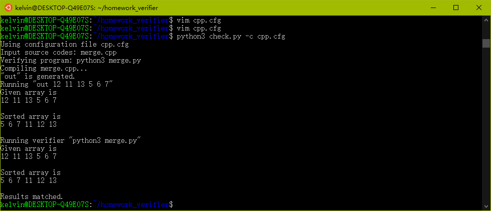

# Simple homework verifier
## Usage
1. Create or configure the configuration file in the working folder (where "check.py" is)
2. Copy the source file into the working folder
3. Execute

`python3 check.py -c <configuration_file>`
## Configration file
- maker - the compile command to generate the executable.
- input - the input source code file.
- output - the output executable.
- verifier - the program to verify the output result.
- in1 - the input argument for the executable if necessary.

## Possible Result
- Wrong usage of check.py - please check if you provide the configuration file for check.py
- Not Compiled - the program has some compiling errors.
- Wrong answer - either there is runtime errors or the results don't match the one from verifier.

## Example
### Homework
Write a C++ program for merge sort. The input unsorted array would be provided as program arguments, e.g.:
`./out 12 11 13 5 6 7`
### Sample configuration file "cpp.cfg"

`[DEFAULT]`

`maker=g++ -o out merge.cpp` <-- The compile command to generate the executable "out"

`input=merge.cpp` <-- The input source code file.

`output=out` <-- The output executable.

`verifier=python3 merge.py` <-- The command to run the verifier program

`[INPUTPARAMS]`

`in1=12 11 13 5 6 7` <-- The input arguments for the executable. Here is the unsorted array.

### Usage

`python3 check.py -c cpp.cfg `

Here is the sample output:

